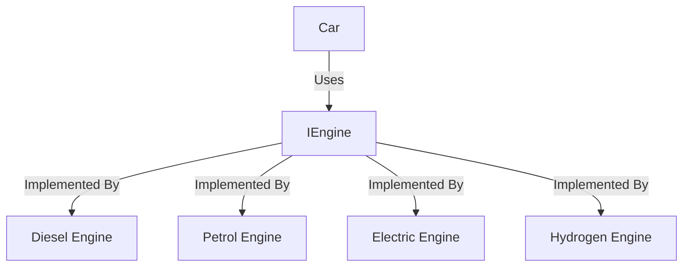

# Interface-Based Composition

Car does not care/ know about type of engine it is using. It only cares about the interface of IEngine. This is an abstract constructor injection. This allows for greater flexibility and easier testing.