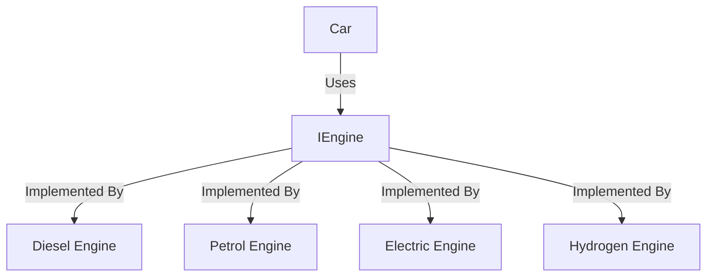

# Interface-Based Composition

Car does not care/ know about type of engine it is using. It only cares about the interface of IEngine. This is an abstract constructor injection. This allows for greater flexibility and easier testing.

# Interface-Based Composition and SOLID Principles

Interface-Based Composition = 
- **Using interfaces** (abstractions)
- **Injecting dependencies** (often via constructor)
- Enables clean, flexible, testable design

---

## 🔍 Does it support all SOLID principles?

| Principle | Supported? | Why / Why Not |
|----------|-------------|---------------|
| **S - Single Responsibility** | ✅ *Partially* | Interface-based composition encourages separation of concerns (e.g., Car uses Engine but doesn’t manage how Engine works). However, SRP is about how responsibilities are grouped, not just how dependencies are wired. |
| **O - Open/Closed**           | ✅✅ *Fully*    | You can add new implementations of an interface (e.g., `NuclearEngine`) without changing the classes that depend on the interface (e.g., `Car`). |
| **L - Liskov Substitution**   | ✅✅ *Fully*    | Any class implementing an interface can be used interchangeably without breaking behavior. (e.g., `Car` can use any `IEngine`.) |
| **I - Interface Segregation** | ✅✅ *Fully*    | Encourages creating small, focused interfaces. Classes only implement what they need. |
| **D - Dependency Inversion**  | ✅✅✅ *Core idea* | The whole goal of Interface-Based Composition is to depend on abstractions (`IEngine`), not concrete types (`PetrolEngine`). This is Dependency Inversion in action. |

---

## ✅ Why Interface-Based Composition is Best Practice

- Promotes **loose coupling**
- Makes code **open for extension, closed for modification**
- Enables **testing with mocks/fakes**
- Works naturally with **Dependency Injection containers**
- Helps enforce SOLID principles throughout your architecture

---

## 🧠 Conclusion

> Interface-Based Composition is **one of the most effective tools** to implement and support SOLID principles, especially:
>
> - ✅ Open/Closed Principle  
> - ✅ Dependency Inversion Principle  
> - ✅ Liskov Substitution  
> - ✅ Interface Segregation  
>
> It also helps support Single Responsibility indirectly by encouraging clean separation of components.

